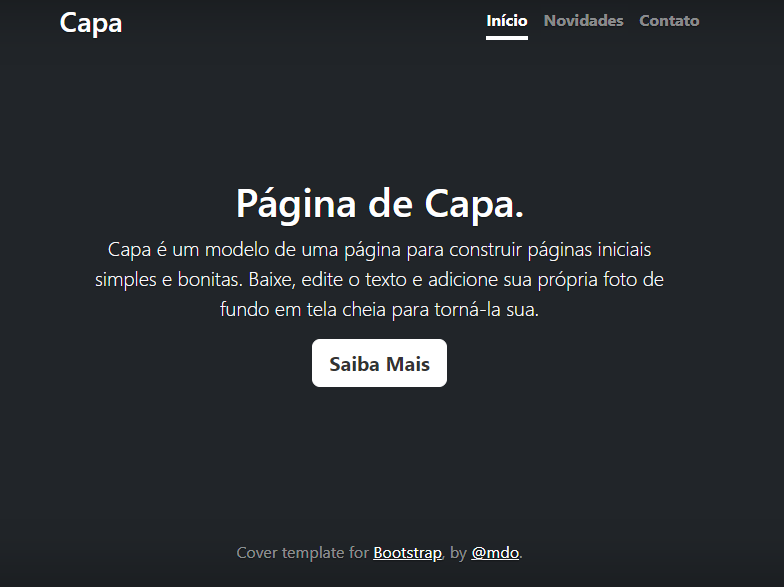

# Índice 

* [Projeto escrita do README](#projeto-escrita-do-readme)
* [ Descrição](#descri%C3%A7%C3%A3o)
* [Funcionalidades](#funcionalidades)
* [Tecnologias utilizadas](#tecnologias-utilizadas)
* [Fontes utilizadas](#fontes-utilizadas)

# Projeto escrita do README

## Descrição
Nesse trabalho, pesquisamos projetos prontos e traduzimos para usar de base para um projeto "nosso".

## Funcionalidades 
Exibir nossas habilidades e nosso estilo de trabalho 

### Tecnologias utilizadas
HTML e CSS

## Fontes utilizadas 
 Google tradutor
